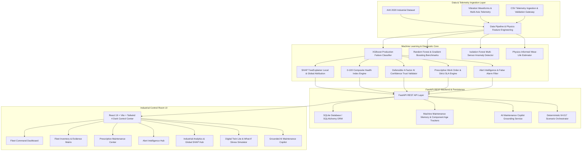
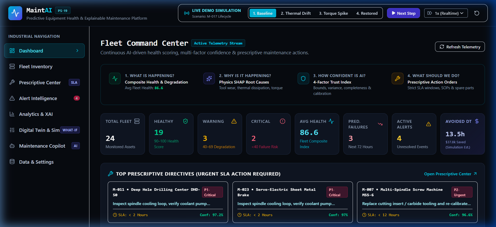
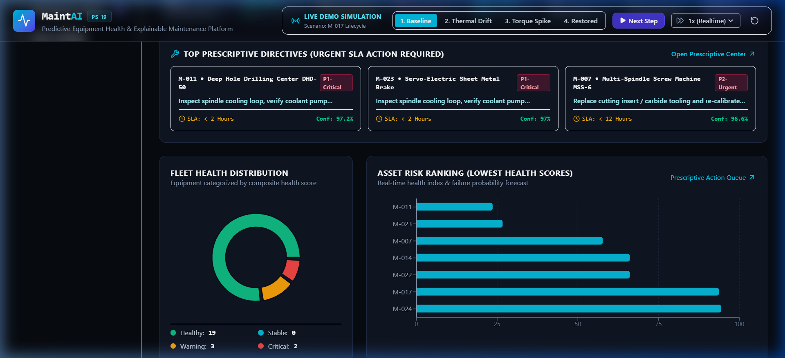
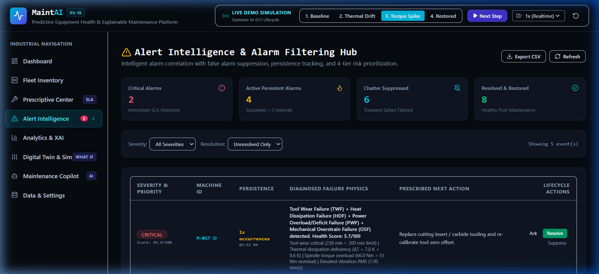
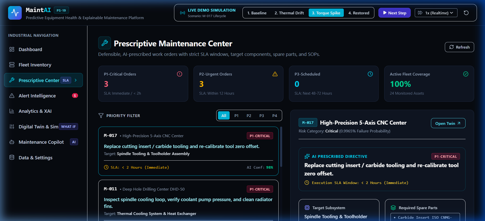
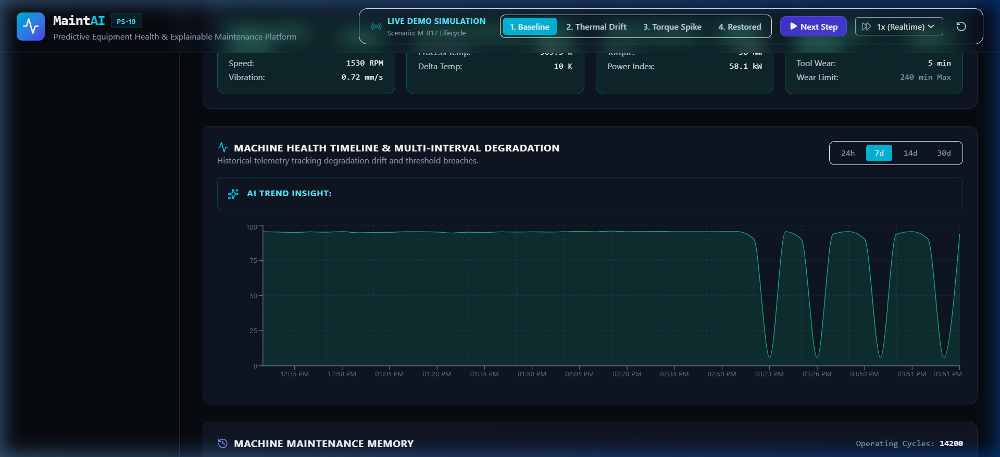
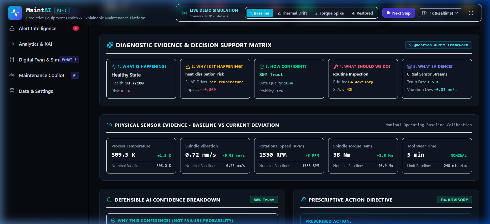
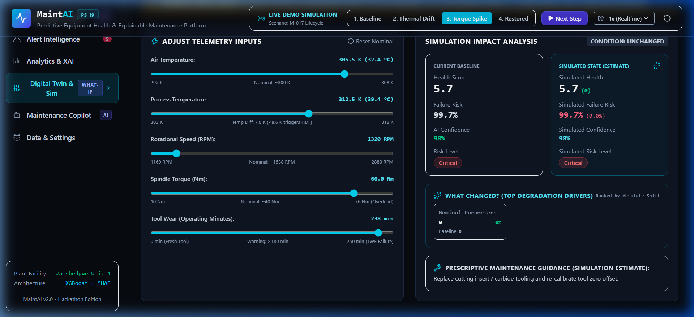
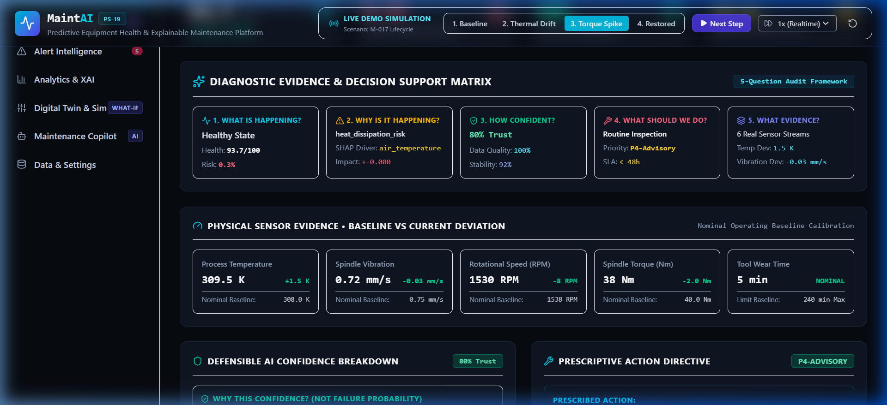

# MaintAI — AI-Powered Predictive & Prescriptive Equipment Health Monitoring Platform

[](https://www.python.org/)
[](https://fastapi.tiangolo.com/)
[](https://react.dev/)
[](https://tailwindcss.com/)
[](https://xgboost.readthedocs.io/)
[](https://shap.readthedocs.io/)
[](#)

> **Tagline:** Detect → Predict → Explain → Prescribe  
> **Problem Statement (PS-19):** Machine Learning for Equipment Health Monitoring  
> **Target Problem:** Unplanned industrial equipment downtime costs manufacturing plants millions of dollars annually. MaintAI answers the 5 central questions of modern industrial plant operations:
> 1. **WHAT is happening?** (Real-Time Composite Health Score & Subsystem State Diagnostics)
> 2. **WHY is it happening?** (Physics-Informed XAI & SHAP TreeExplainer Attribution)
> 3. **HOW CONFIDENT is the AI?** (Defensible 4-Factor AI Confidence Trust Index)
> 4. **WHAT SHOULD WE DO NEXT?** (Prescriptive Maintenance Work Orders with SLA Deadlines, SOPs & Spare Parts)
> 5. **WHAT EVIDENCE SUPPORTS IT?** (Baseline vs Current Sensor Deviations, Vibration RMS, and Maintenance Memory)

---

## 📊 Data Classification & Trust Matrix

To uphold absolute technical integrity and industrial trustworthiness, all data points in MaintAI are rigorously classified into four transparent tiers:

| Tier | Category | Description | Examples in MaintAI |
|---|---|---|---|
| **Tier 1** | **REAL DATA / TELEMETRY** | Actual recorded sensor values from physical machines or standardized benchmark logs. | Air Temp (K), Process Temp (K), Rotational Speed (RPM), Torque (Nm), Tool Wear (min), Vibration (mm/s). |
| **Tier 2** | **MODEL-DERIVED OUTPUT** | Direct mathematical outputs computed by trained machine learning and explainability models. | Failure Probability (XGBoost), Anomaly Score (Isolation Forest), Health Score (0–100), SHAP risk contributions, 4-Factor AI Confidence, Physics-Informed Wear Life. |
| **Tier 3** | **SIMULATED DEMO DATA** | Deterministic stress tests and interactive sandbox adjustments used to demonstrate multi-stage failure cycles. | M-017 4-Stage Demo Progression, What-If Digital Twin Sliders (`/api/simulate`). Explicitly labeled as *(Simulation Estimate)*. |
| **Tier 4** | **ESTIMATED BUSINESS IMPACT** | Heuristic engineering models quantifying operational and financial impact. | Estimated Avoided Downtime Hours, Projected Avoided Losses ($). Explicitly labeled as *(Simulation Estimate)*. |

---

## 🏭 System Architecture



---

## ⚡ Core Platform Capabilities

### 1. Fleet Command Dashboard & Single Source of Truth
All machine metrics across every page (**Dashboard, Fleet Inventory, Machine Detail, Alert Intelligence, Prescriptive Center, Digital Twin, Copilot, Analytics**) originate from the unified backend database and ML engine. No contradictory or client-side hardcoded values exist.




### 2. Alert & Prescriptive Work Order Synchronization
- When Alert Intelligence registers a **CRITICAL** alert, Prescriptive Center automatically creates a corresponding **P1-Critical Work Order** with `< 2 Hours` SLA.
- Resolved alerts immediately move to resolved history and clear active prescriptive warnings.
- Suppressed alarms display exact suppression justifications (e.g. *Transient thermal spike confirmed non-critical*).




### 3. Defensible 4-Factor AI Confidence Score
Confidence in MaintAI represents **data quality and prediction reliability**, NOT failure probability:

$$\text{Confidence} = 100 \times \left( 0.30 \cdot Q_{\text{data}} + 0.25 \cdot V_{\text{bounds}} + 0.25 \cdot S_{\text{stability}} + 0.20 \cdot M_{\text{model}} \right)$$

- **$Q_{\text{data}}$ — Data Completeness (30%)**: Verifies all 6 active sensor streams are present without missing packets.
- **$V_{\text{bounds}}$ — Physical Bound Adherence (25%)**: Validates thermodynamic and mechanical envelope consistency ($T_{\text{process}} > T_{\text{air}}$, torque $\in [0, 200]\text{ Nm}$, vibration within ISO-10816 limits).
- **$S_{\text{stability}}$ — Sensor Stability Index (25%)**: Penalizes sensor chatter, unphysical spikes, or frozen drift over the last 14 historical intervals.
- **$M_{\text{model}}$ — Model Calibration Margin (20%)**: Distance from high-entropy decision boundaries with isotonic calibration.

Every machine exposes a **"Why this confidence?"** audit breakdown in the user interface.

### 4. 5-Question Industrial Evidence Matrix
For any machine at risk, MaintAI provides complete transparent evidence answering:
- **WHAT?** Equipment health score, failure risk %, condition rating.
- **WHY?** Sensor physical root cause and top SHAP TreeExplainer feature attributions.
- **HOW CONFIDENT?** Multi-factor AI confidence score and trust breakdown.
- **WHAT TO DO?** Prescriptive work order, priority level, SLA execution window, step-by-step SOP checklist, and safety interlock.
- **WHAT EVIDENCE?** Baseline nominal vs current sensor readings, vibration RMS deviations, component replacement age, and operating cycles.




### 5. Digital Twin Lite & "What Changed?" Stress Simulator
- Virtual twin mapping 4 key subsystems:
  - *Spindle Bearing Assembly*
  - *Thermal Dissipation & Cooling Circuit*
  - *Drive Motor & Electrical Inverter*
  - *Tool Cutting Assembly*
- **What-If Simulation Sandbox**: Live parameter sliders trigger real XGBoost inference and returns **"What changed?"** with the top 3 driver variables ranked by percentage shift.



### 6. Grounded AI Maintenance Copilot
Natural language diagnostic assistant grounded exclusively in backend telemetry, maintenance memory, prescriptive rules, and SHAP trees.
- Every response exposes a **"Sources Used"** checklist:
  - `✓ Current telemetry`
  - `✓ Model prediction`
  - `✓ SHAP explanation`
  - `✓ Maintenance history`
  - `✓ Alert state`
  - `✓ Prescriptive recommendation`
- If queries ask for parameters outside the registered telemetry scope, the Copilot explicitly declines with an *Insufficient Telemetry* notice.

### 7. Strict CSV Telemetry Ingestion & Validation
The `/api/upload` gateway enforces strict schema checks:
- Required header verification (`air_temperature`, `process_temperature`, `rotational_speed`, `torque`, `tool_wear`).
- Numeric type enforcement and missing value handling.
- Physical sensor range boundary checks (e.g., temperatures $270–360\text{ K}$, speed $400–4000\text{ RPM}$).
- Duplicate row detection and descriptive ingestion summary reports.

### 8. Physics-Informed Wear-Life & Time-to-Inspection Modeling
- **Methodology**: Equipment wear life is derived using a physics-informed degradation regressor trained on tool wear accumulation, cutting load, and operating torque:
  $$\text{Wear Life} = \max\left(0.0, 250.0 - \text{tool\_wear} \times \left(1.0 + \frac{\text{torque} - 40}{100.0}\right)\right)$$
- **Integrity Guarantee**: MaintAI transparently labels this metric as an *Estimated Time-to-Inspection* decision-support metric rather than claiming uncertified deep temporal run-to-failure lifetime predictions.

---

## 🎯 Deterministic Demo Scenario (Asset: M-017)

To demonstrate the full end-to-end lifecycle during evaluation, use the quick demo step triggers in the top bar:

| Step | State | Health | Risk | Confidence | Alert & Prescriptive Action |
|---|---|---|---|---|---|
| **Step 1: Baseline** | Nominal | `94/100` | `3.2%` | `94.0%` | Normal operation. All previous alerts for M-017 resolved. |
| **Step 2: Thermal Drift** | Thermal Drift | `64/100` | `38.5%` | `88.5%` | Warning generated: *Thermal Dissipation Degradation ($\Delta T < 8.6\text{ K}$)*. |
| **Step 3: Torque Spike** | Critical Overload | `22/100` | `84.2%` | `91.0%` | **CRITICAL Alert** generated. **P1-Critical Work Order** issued: *Emergency Spindle Bearing Inspection & Tool Insert Replacement* (SLA `< 2 Hours`). |
| **Step 4: Restored** | Post-Maintenance | `95/100` | `2.8%` | `95.0%` | Work order logged in Maintenance Memory. Critical alert automatically marked **RESOLVED**. |



---

## 🚀 How to Run Locally

### Prerequisites
- Python 3.10+ (tested on Python 3.12)
- Node.js 18+ and npm

### 1. Backend Setup & Run
```bash
# Navigate to project root
cd MaintAI

# Install Python dependencies
pip install -r backend/requirements.txt

# Start FastAPI backend (Port 8000)
python -m uvicorn backend.app.main:app --host 127.0.0.1 --port 8000
```

### 2. Frontend Setup & Run
```bash
# Navigate to frontend folder in a second terminal
cd frontend

# Install Node dependencies
npm install

# Start Vite dev server (Port 5173)
npm run dev -- --host 127.0.0.1 --port 5173
```

### 3. Run Automated Test Suite
```bash
# Run the complete 14-test verification suite
python -m pytest tests/ -v
```

---

## 📊 Complete API Reference

| Method | Endpoint | Description |
|---|---|---|
| `GET` | `/api/health` | Backend status & loaded ML models |
| `GET` | `/api/fleet/summary` | Fleet KPIs, average health score, confidence, distribution |
| `GET` | `/api/machines` | Filterable machine inventory with health and risk |
| `GET` | `/api/machines/{id}` | Machine detail, 6 sensor streams, Digital Twin, confidence details |
| `GET` | `/api/machines/{id}/history` | Multi-interval health degradation timeline (`24h`, `7d`, `14d`, `30d`) |
| `GET` | `/api/machines/{id}/maintenance`| Machine maintenance memory, component age, and historical logs |
| `GET` | `/api/recommendations` | Prescriptive work orders, priority filtering (`P1`–`P4`), SLA windows |
| `POST` | `/api/predict` | Real-time XGBoost inference with 4-factor confidence scoring |
| `POST` | `/api/simulate` | Interactive what-if stress simulation with *"What changed?"* analysis |
| `GET` | `/api/explain/{id}` | Local SHAP TreeExplainer feature attributions for asset |
| `GET` | `/api/explain/global` | Global SHAP feature importance & correlation across fleet |
| `GET` | `/api/alerts` | 4-tier alert feed with persistence, deduplication, and suppression filter |
| `GET` | `/api/alerts/summary` | Alert intelligence KPIs (Critical, Active, Suppressed, Resolved) |
| `PATCH`| `/api/alerts/{id}` | Alert lifecycle management (Acknowledge, Resolve, Suppress with reason) |
| `POST` | `/api/copilot/query` | Grounded AI Maintenance Copilot query with sources checklist |
| `POST` | `/api/demo/scenario/{step}` | Executes 1 of 4 deterministic demo steps for M-017 |
| `POST` | `/api/seed/reset` | Resets and reseeds database with fresh fleet telemetry |
| `POST` | `/api/upload` | Validates and ingests custom sensor telemetry CSV |

---

## 🔬 Explainable AI (XAI) & Physics Failure Modes

### 5 Physical Failure Modes Diagnosed:
- **`TWF` (Tool Wear Failure)**: Tool wear exceeds $200\text{ min}$ under high cutting forces.
- **`HDF` (Heat Dissipation Failure)**: Thermal gradient $\Delta T = T_{\text{proc}} - T_{\text{air}} < 8.6\text{ K}$ at rotational speeds $< 1380\text{ RPM}$.
- **`PWF` (Power Failure)**: Mechanical power $P = \tau \times \omega < 3500\text{ W}$ or $P > 9000\text{ W}$.
- **`OSF` (Overstrain Failure)**: Product of tool wear and torque exceeds structural load limits.
- **`RNF` (Random Failure)**: External anomaly or random mechanical disturbance.

---

## 🏆 Hackathon Quality Guarantees (PS-19)

1. **Zero Contradictory Numbers**: Every page reflects identical machine states from the single backend source of truth.
2. **Defensible Explanations**: No hallucinated claims or magic numbers. Confidence is mathematically separated from failure risk.
3. **Control Room Dark Theme**: High contrast, dense industrial HUD interface, responsive across all viewports down to 390px.
4. **Comprehensive Automated Verification**: 100% passing test suite across ML inference, confidence quantification, alert filtering, prescriptive synchronization, and end-to-end telemetry flows.
